# Class Model

This document describes the package structure and class details of the RideWise system after refactoring to support dependency inversion, single responsibility, custom exception frameworks, and vehicle-specific fare strategies.

## Mermaid Class Diagram

```mermaid
classDiagram
    direction TB
    class Location {
        +double x
        +double y
        +distanceTo(Location other) double
    }
    class Rider {
        +String id
        +String name
        +Location location
    }
    class Driver {
        +String id
        +String name
        +Location currentLocation
        +boolean available
        +VehicleType vehicleType
        +int completedRides
        +incrementCompletedRides()
    }
    class Ride {
        +String id
        +Rider rider
        +Driver driver
        +double distance
        +RideStatus status
        +FareReceipt fareReceipt
    }
    class RideRequest {
        +String riderId
        +double distance
        +VehicleType preferredVehicleType
    }
    class FareReceipt {
        +String rideId
        +double amount
        +LocalDateTime generatedAt
    }
    class RideStatus {
        <<enumeration>>
        REQUESTED
        ASSIGNED
        COMPLETED
        CANCELLED
    }
    class VehicleType {
        <<enumeration>>
        BIKE
        AUTO
        CAR
    }
    
    class RiderService {
        <<interface>>
        +registerRider(String, Location) Rider
        +getRiderById(String) Rider
        +getAllRiders() Collection~Rider~
    }
    class DriverService {
        <<interface>>
        +registerDriver(String, Location, VehicleType) Driver
        +getDriverById(String) Driver
        +getAvailableDrivers() List~Driver~
        +getAllDrivers() Collection~Driver~
        +bookDriver(String) void
        +releaseDriver(String, Location) void
        +cancelDriverBooking(String) void
    }
    class RideService {
        <<interface>>
        +requestRide(RideRequest) Ride
        +completeRide(String) Ride
        +cancelRide(String) Ride
        +getAllRides() Collection~Ride~
        +setRideMatchingStrategy(String) void
        +setFareStrategy(String) void
    }

    class InMemoryRiderService {
        -Map~String, Rider~ riders
    }
    class InMemoryDriverService {
        -Map~String, Driver~ drivers
    }
    class RideServiceImpl {
        -DriverService driverService
        -RiderService riderService
        -RideMatchingStrategy rideMatchingStrategy
        -FareStrategy fareStrategy
        -Map~String, Ride~ rides
    }

    RiderService <|.. InMemoryRiderService
    DriverService <|.. InMemoryDriverService
    RideService <|.. RideServiceImpl

    class RideMatchingStrategy {
        <<interface>>
        +findDriver(Rider, List~Driver~, VehicleType) Driver
    }
    class NearestDriverStrategy {
    }
    class LeastActiveDriverStrategy {
    }

    RideMatchingStrategy <|.. NearestDriverStrategy
    RideMatchingStrategy <|.. LeastActiveDriverStrategy

    class FareStrategy {
        <<interface>>
        +calculateFare(Ride) double
    }
    class DefaultFareStrategy {
    }
    class PeakHourFareStrategy {
    }

    FareStrategy <|.. DefaultFareStrategy
    FareStrategy <|.. PeakHourFareStrategy

    class StrategyRegistry {
        +getMatchingStrategy(String) RideMatchingStrategy
        +getFareStrategy(String) FareStrategy
    }
```

## Description of Refactored Classes

1. **DTOs and Models**:
   - `RideRequest`: Encapsulates ride creation parameters (rider ID, distance, preferred vehicle type), removing primitive obsession.
   - `Location`: Enforces basic mathematical distance calculation between points.
   - `Driver`, `Rider`, `Ride`, `FareReceipt`: Basic domain model classes with encapsulation controls.
2. **Service Abstractions (DIP)**:
   - `RiderService`, `DriverService`, and `RideService` are now abstract interfaces defining operations.
   - `InMemoryDriverService`, `InMemoryRiderService`, and `RideServiceImpl` implement these interfaces and contain the in-memory details.
3. **Strategy Registry**:
   - `StrategyRegistry`: Acts as a factory catalog allowing lookups of strategies by name, avoiding hardcoded object instantiations in the UI controller.
