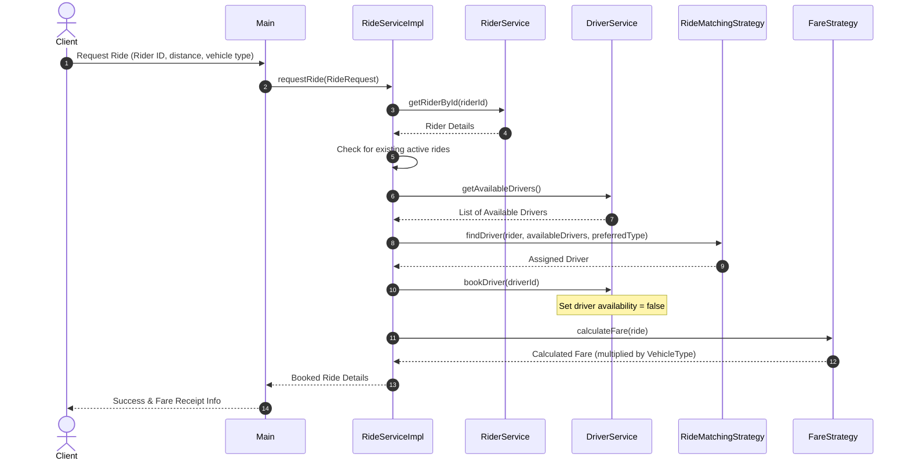

# Object Relationships & Interactions

This document describes how the objects interact and associate with each other in RideWise.

## Diagram of Object Interactions (Request Ride Flow)

## Detailed Relationships

1. **Rider & Driver to Ride**:
   - `Ride` maintains direct references (association) to `Rider` and `Driver`.
2. **Ride & FareReceipt**:
   - `Ride` maintains a one-to-one composition relationship with `FareReceipt`.
3. **RideServiceImpl to Services (DIP)**:
   - `RideServiceImpl` has references to the `RiderService` and `DriverService` interfaces (Composition). It does not know or depend on concrete data storage details (e.g. In-Memory maps).
4. **RideServiceImpl to Strategies (OCP/DIP)**:
   - `RideServiceImpl` holds references to `RideMatchingStrategy` and `FareStrategy` abstractions. The specific strategy implementation details are decoupled from the service.
5. **Main Controller and Strategies**:
   - `Main` uses the static methods of `StrategyRegistry` to obtain strategy instances by name and configure them on `RideService`, preventing tight coupling between the client controller and strategy classes.
